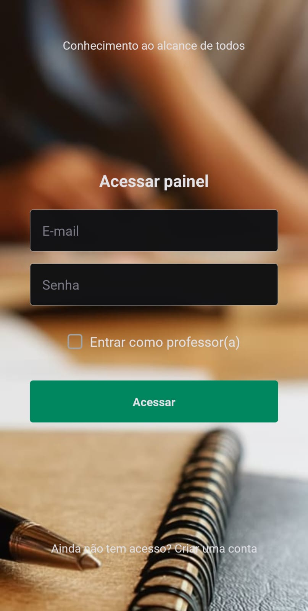
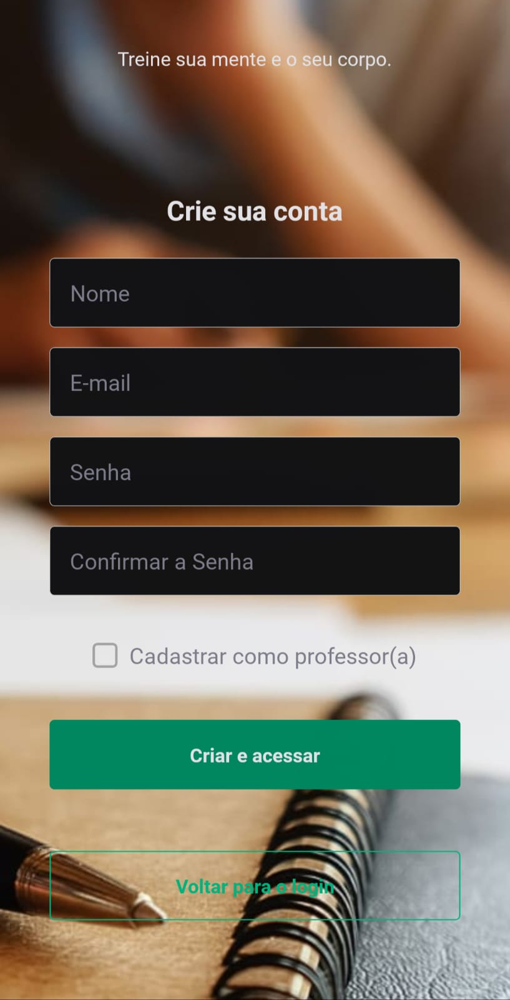
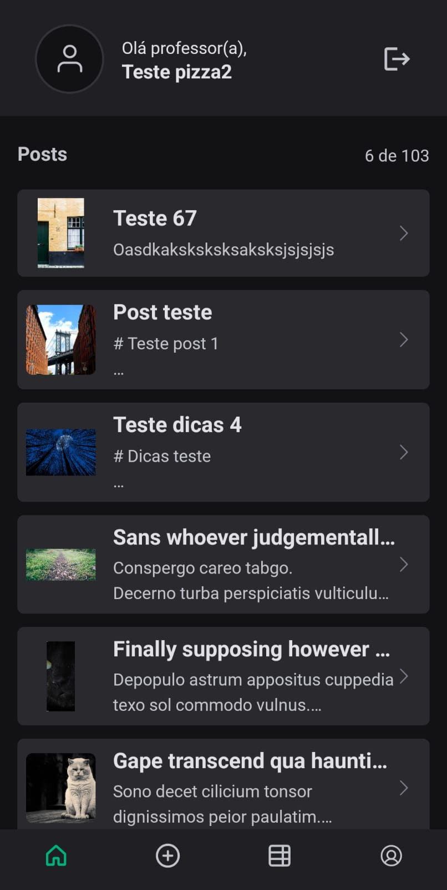
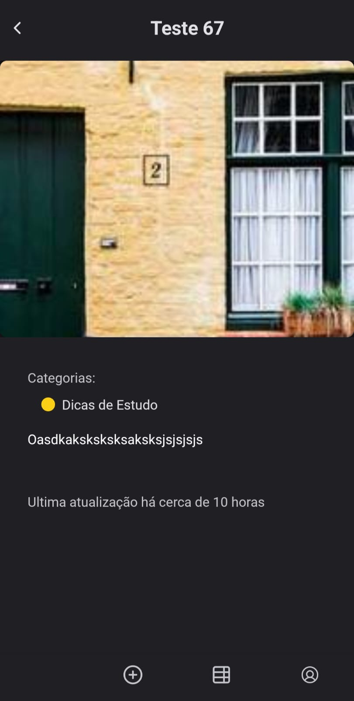
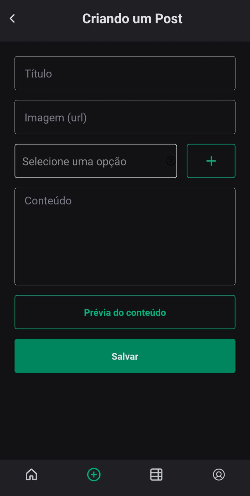
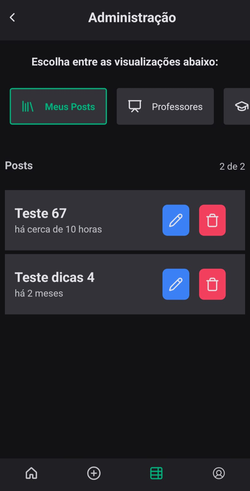
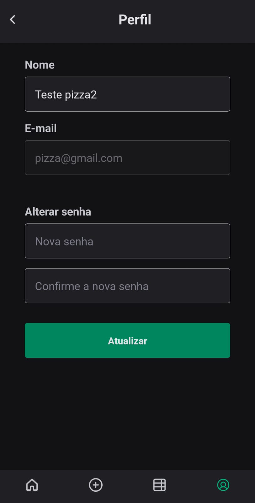

<h1 style="display: flex; gap: 1rem;"> 
  
  Fiaposts 
</h1>

<a href="https://www.fiap.com.br/">

</a>

No cenário educacional contemporâneo, a integração da tecnologia desempenha um papel fundamental na facilitação do aprendizado e no acesso à informação. Nesse contexto, plataformas online têm emergido como ferramentas essenciais para promover a interação entre educadores e estudantes, estimulando o compartilhamento de conhecimento de forma dinâmica e colaborativa.

Com o objetivo de promover o compartilhamento de conhecimento, foi criada a plataforma FIAPOSTS, uma plataforma da faculdade FIAP, que disponibiliza uma interface para criação e manipulação de posts educacionais. Desta forma os professores poderão transmitir conhecimento para seus alunos, através de posts.

## 💻 Telas

### Login



Nessa Tela é possível realizar o login na aplicação, tendo que informar o email e senha, e clicar no botão "Acessar". Caso o usuário queira entrar como professor então ele pode clicar em "Entrar como professor(a)". Além disso é possível clicar em "Crie uma conta" para ser redirecionado para a tela de cadastro de usuário.

### Cadastro



Nessa Tela é possivel realizar o cadastro de usuário da aplicação, sendo possivel cadastrar como professor ou aluno.

### Posts (Tela principal)



Nessa Tela é possível visualizar todos os posts criados (por todos).

### Visualização de um Post



Nessa Tela é possível visualizar os detalhes de um post, tal como o título, categorias, foto principal, data de última atualização e conteúdo.

### Cadastro / Edição de um Post



Nessa Tela é possível criar/editar um post, tendo que informar o título, a imagem (como url), o conteúdo (em formato markdown) e as categorias (pelo menos 1 categoria). Nessa tela também é possível pré-visualizar como o post ficará quando for publicado, desta forma é possível visualizar o markdown renderizado antes mesmo de publicar.

### Página adminitrativa



Nessa Tela é visualizar 3 tipos de visualições:

- Meus Posts: todos os posts criados pelo usuário logado (E sendo possivel alterar ou excluir eles)
- Professores: Listagem de todos os professores
- Aluno: Listagem de todos os alunos

### Perfil



Nessa Tela é possivel alterar as informações do usuário logado.

## 🛠️ Tecnologias

As seguintes tecnologias foram usadas na construção do projeto:

- [React Native](https://react.dev/)
- [Expo](https://docs.expo.dev/tutorial/introduction/)
- [Typescript](https://www.typescriptlang.org/)
- [Gluestack UI](https://gluestack.io/)

## Pré-requisitos

Antes de começar, você vai precisar ter instalado em sua máquina as seguintes ferramentas:
[Git](https://git-scm.com) e [Node.js](https://nodejs.org/en/).
Além disto é bom ter um editor para trabalhar com o código como [VSCode](https://code.visualstudio.com/)

### 🎲 Rodando o Back End e o Banco de Dados (servidor)

```bash
# Clone este repositório
$ git clone <https://github.com/LucasCancio/fiaposts-api>

# Acesse a pasta do projeto no terminal/cmd
$ cd fiaposts-api

# Monte o container
$ docker-compose up

# O servidor inciará na porta:3010
```

## 🔧 Instalação

```bash
# Clone este repositório
$ git clone <https://github.com/LucasCancio/fiaposts-mobile>

# Acesse a pasta do projeto no terminal/cmd
$ cd fiaposts-mobile

# Instale as dependências
$ npm install

# Execute a aplicação em modo de desenvolvimento
$ npm start

# O servidor inciará com Expo (escane o QRCode com o aplicativo)
```

## 📝 Licença

Este projeto esta sobe a licença MIT.

Feito com ❤️ por Lucas Cancio
